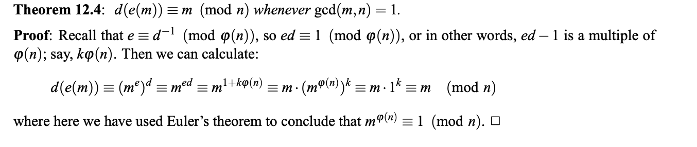

# Lab 1 Theory

## What's the point of encryption ?

Encryption is a crucial part of everyday online communication. From texting a friend to filling out confidential documents, encryption plays an irreplaceable role that protects the exchange of data. 

The process of securing the transfer of data from one user to another can be broken down into the following steps:

1. Suppose user 1, Alice would like to send a message to user 2, Bob. Alice would like to send the message "you smell bad" to Bob. The unprotected message "you smell bad" is known as the plaintext. 

2. In order to send it to Bob and have the data be protected, the plaintext must be encrypted using a cryptographic mathematical model with Bob's public key. Once the plaintext is encrypted, it becomes a ciphertext that is unreadable by anyone who cannot decrypt it.

3. Once the plaintext is transformed into a ciphertext, it is transmitted and recieved by Bob. However, Bob cannot read the ciphertext as it is ! In order for him to be able to obtain the message from Alice, he will need to decrypt the ciphertext using a cryptographic mathematical model and his private key. This will transform the ciphertext into a readable format: namely, plaintext.

4. Bob can now read Alice's message. Thanks to the plaintext, he realizes he has a body odor issue. Bob goes to the nearest drugstore to buy Axe body spray since he finds showering very annoying. Even though he'll smell like a nose-blind middle schooler, at least he won't smell like fermenting onions and poo. 

The above steps can be visualized in the image below:


## RSA: The Best Method of Encryption
- As mentioned in the second part of the encryption-decryption process, a cryptographic mathematical model is used to transform the plaintext to ciphertext. There are several models that exist to perform this task. However, the strongest and most commonly used model is RSA. RSA stands for Rivest, Shamir and Adleman who are the inventors of this encryption process.

## Foundational Number Theory:
- Prime Number: A prime number is a positive integer n that is greater than 1 and its factors are 1 and itself.
- Greatest common divisor: The greatest common divisor (GCD) between two nonzero integers (for instance: a and b) is the largest postiive integer that is a common factor of a and b.
- Coprime/relatively prime numbers: Two nonzero integers are coprime if their GCD is 1. It is a known fact that two distict prime numbers will always have a GCD of 1.
- Congruences: consider two integers a and b. Consider another nonzero integer c. a is congruent to b if and only if a / c has the same remainder as b / c. In other words, a % c = b % c.
This can be expressed as:
```console
a ≡ b (mod c)
```
## Useful lemmas and theories:
### Euler's Phi Function:
For a nonzero integer n, Euler's phi function determines all the possible integers (less than n) that are coprime to n.
```console
For instance, suppose n = 20. ϕ(n)= ϕ(20)= 1, 3, 7, 9, 11, 13, 17, 19
```
### Eucledean Algorithm (tofind d):
The Euclidean Algorithm is used to find the GCD of two integers, A and B. The process is as follows: (from Khan Academy)
- If A = 0 then GCD(A,B)=B, since the GCD(0,B)=B, and we can stop.  
- If B = 0 then GCD(A,B)=A, since the GCD(A,0)=A, and we can stop.  
- Else, write A in quotient remainder form (A = B⋅Q + R). Then, repeat the process using GCD(B,R) using the Euclidean Algorithm since GCD(A,B) = GCD(B,R).
### Euler's Totient Function:
The University of Berkeley defines Euler's Totient Function as the following lemma:
```console
Let p,q be two distinct primes, and n = pq. Then ϕ(n) = (p−1)(q−1).
```
### Chinese Remainder Theorem:
The University of Berkeley defines the Chinese Remainder Theorem as follows:
```console
Let m,n be relatively prime, and let a,b be arbitrary.
Then the pair of equations x ≡ a (mod m), x ≡ b (mod n) have a unique solution for x mod mn.
```
## How does RSA work ? 
RSA relies heavily on the inability to factorize very large numbers. The process of encrypting data with this principle can be broken down into the following steps:
1. Choose two different prime numbers to generate the public and private keys.
For both public and private keys, the value of n will be utilized. The value of n can be calculated by doing the following where p and q are two distinct prime integers:
```console
n = p*q
```
The value of phi(n) also needs to be calculated in order to find both the public and private keys. This is done using Euler's Totient Function since n is the product of two distinct prime numbers. Therefore, this infers that:
 ```console
ϕ(n) = (p−1)*(q−1)
```
2. To finish calculating the public key, we need to find the value of e, which can be any number in the integer space. However, it MUST be coprime to phi(n). In other words, the greatest common divisor for phi(n) and e must be 1. This is to ensure that there exists an inverse modulo of ϕ(n), implying there exists a value of d such that e*d≡ 1 mod (ϕ(n)).

3. Finally, to finish computing the private key, we need to find the value of d. This is done by finding the value of d with the Euclidean algorithm for the following equation:
 ```console
e*d≡ 1 mod (ϕ(n))
```
The resulting keys are:
 ```console
private: (p,q,d)
public: (n,e)
```

### Encrypting a message:
- To encrypt a message m (translated into ascii format), we use the following equation:
```console
e(m) ≡ m^e (mod n)
```
### Decrypt a message:
- To decrypt a ciphertext c, where d ≡ e−1(mod ϕ(n)). we use the following equation:
```console
d(c) ≡ c^d (mod n)
```
- This is the inverse of the encryption function and this is proven with the following exerpt from the University of Berkeley:


## Why is RSA the best ?
- RSA is the best known encryption method since it weaponizes the factorization of large numbers. Even with some of the most powerful computing systems, it is extremely difficult to determine the values of p and q, which will determine the factors of phi(n) that determine the value of d to decrypt ciphertexts.