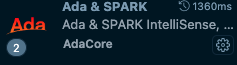

# Lab Instructions

## Install Alire 
### What is Alire ? 
Alire is the package manager for the Ada programming language.    
Alire is to Ada like what pip is to Python.

### Why you need Alire:
Alire is crucial to building and compiling this project.

### MacOS
#### Download Alire for MacOS:    
- Navigate to https://github.com/alire-project/alire/releases/latest
- Download the file named alr-[latest_version]-bin-x86_64-macos.zip, where [latest_version] will be the most current version number.
- Unzip the downloaded file. 
- Rename the unzipped folder to just `alire`.

#### Add the `alr` binary to your path:
- Open the terminal and run:
```console
echo "$HOME/Downloads/alire/bin" | sudo tee /etc/paths.d/alr_config > /dev/null
```
- Change the permission of the created file with the following command:
```console
sudo chmod 644 /etc/paths.d/alr_config
```
- Update the machine's PATH:    
```console
sudo /usr/libexec/path_helper -s
```
- Check if alr is recognized: Run the command below. It should return a valid path. If not, restart the installation.
```command
which alr
```

#### Cloning the lab starter repository:
- Create a folder on your local machine.
- Navigate to this location in the terminal using the `cd`command:
```console
cd [your-path-to-created-folder]
```
- Execute the following command in the terminal:
```console
git clone https://github.com/GNAT-Academic-Program/lab_rsa
```

#### Download Visual Studio Code for MacOS:   
- Navigate to https://code.visualstudio.com/sha/download?build=stable&os=darwin-universal
- Unzip the downloaded file. 
- Open the unzipped file.

NOTE: Brew for MacOS may be helpful for this installation. The instructions to install Brew can be found at: https://formulae.brew.sh/cask/visual-studio-code 

#### Installing the Ada & SPARK Extension for Visual Studio Code:    
- Click on the extension button in Visual Studio Code that looks like the following:

- Search for "Ada & SPARK"<br>

- Once you find the correct version (as seen below), click "Install".

#### Opening the lab project files:    
- On the home page, click 'Open Folder'. Alternatively, you can find the option to 'Open Folder' through: File -> Open folder
- Navigate to the Gihub repository that you cloned in the previous steps. Select Open.


